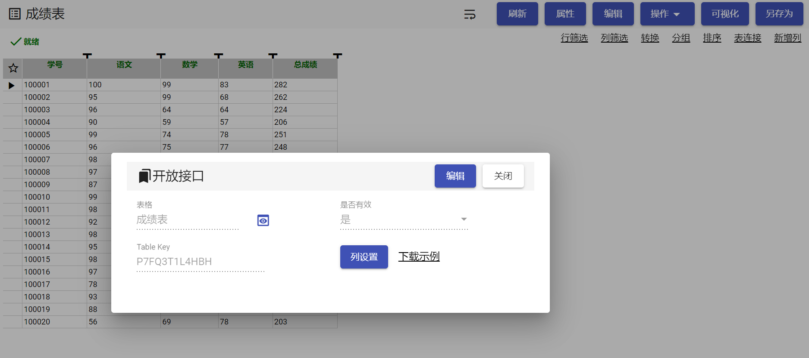

# briskbi-open-api
BriskBi是一款免费的BI（商业智能）软件，提供开放接口，可以通过这些接口抓取BriskBi处理好的数据，用于开发大屏看板。

briskbi将Excel基于“单元格“的公式计算扩展到基于“行和列”的公式计算，内置可视化公式编辑器，无需学习SQL，8个表格变换操作可以实现所有SQL查询功能。表格可以可视化为各种图表，各种图表又可以像操作PowerPoint一样组合成数据看板。

# 步骤
1.在网站http://wwww.briskbi.com 下载软件安装包，下载免费版即可。<br>
2.在表格的“操作”下拉菜单中选择“开放接口选项”，生成针对该表格的table_key。。<br>
3.按照example.html中的示例调用接口获取数据, 编写代码生成大屏看板，<br>推荐使用echart,d3.js,three.js, angular, vue, reactjs等组件库进行开发。<br>
<br>


```html
<!DOCTYPE html>
<html lang="en" xmlns:th="http://www.w3.org/1999/xhtml">
<head>
<meta charset="UTF-8"/>
<title>Examples</title>
<script>
  var xhr = new XMLHttpRequest();
  var table_key ='P7FQ3T1L4HBH';
  var where = '';
  var orderby = '';
  var from = 1;
  var to = 10;

  xhr.onreadystatechange = function() {
    if(xhr.readyState === 4) {
        if(xhr.status >= 200 && xhr.status < 300) {
            var obj = JSON.parse(xhr.responseText);
            if(obj.success=='OK'){
            	renderTable(obj.data);
            }else{
            	document.getElementById("myerror").innerHTML = xhr.responseText;
            }
        }else{
        	document.getElementById("myerror").innerHTML = xhr.responseText;
        }
    }
  }

  function loadData(){
    var params = 'table_key='+ table_key + '&where=' + where + '&orderby='+orderby+ '&from='+from+ '&to='+to;
    var url = 'http://127.0.0.1:8088/session/get_data_pack_open?' + params;
    xhr.open('get', url, true);
    xhr.send();
  }

  function renderTable(data){
    var list = data.model.list;
    var count = data.model.count;
    var content ='Total count: '+count+', Show from ' +from+' to '+to +" <span style=\"color:green;\">(Right click to view the webpage source code)</span>";
    content += "<table class=\"form-table\">";
    content += "<tr>";
    content += "<th>学号</th>";
    content += "<th>语文</th>";
    content += "<th>数学</th>";
    content += "<th>英语</th>";
    content += "<th>总成绩</th>";
    content += "</tr>";
    for(var i=0;i<list.length;i++){
      content += "<tr>";
      content += "<td>"+list[i]['f0']+"</td>";
      content += "<td>"+list[i]['f1']+"</td>";
      content += "<td>"+list[i]['f2']+"</td>";
      content += "<td>"+list[i]['f3']+"</td>";
      content += "<td>"+list[i]['m0']+"</td>";
      content += "</tr>";
    }
    content += "</table>";
    document.getElementById("mytable").innerHTML = content;
  }

  setTimeout(()=>{ loadData(); },1000);
</script>

<style type="text/css">
  form-table{
    border-top:1px solid gray;
    border-left:1px solid gray;
    border-spacing: 0;
  }
  .form-table th,.form-table td{
    border-right:1px solid gray;
    border-bottom:1px solid gray;
    padding:2px 5px;
  }
  .form-table th{
    background-color: lightgray;
  }
</style>
</head>
<body>
  <div id="mytable"></div>
  <div id="myerror" style="color:red;"></div>
</body>
</html>
```
